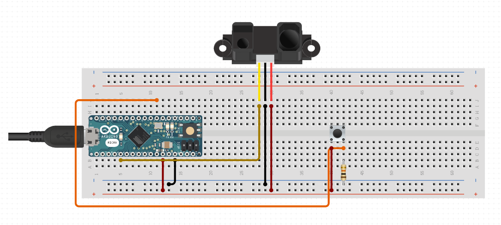
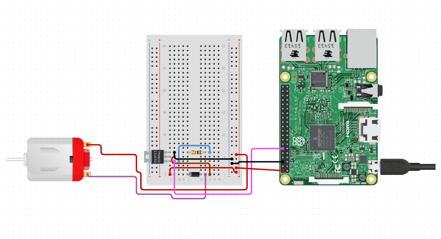
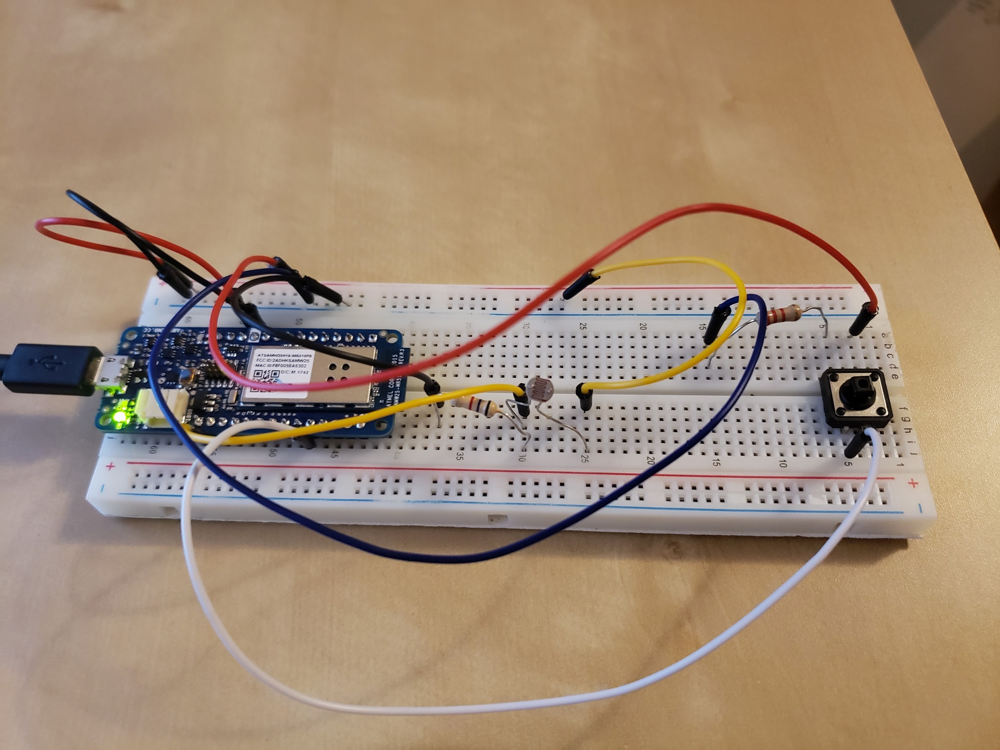
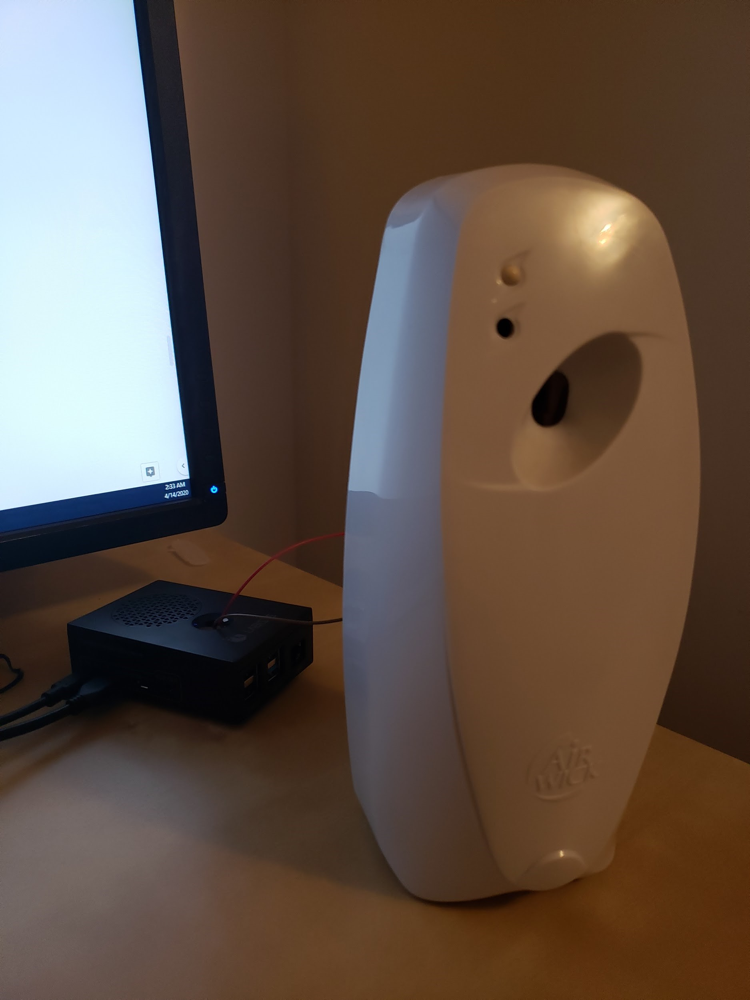
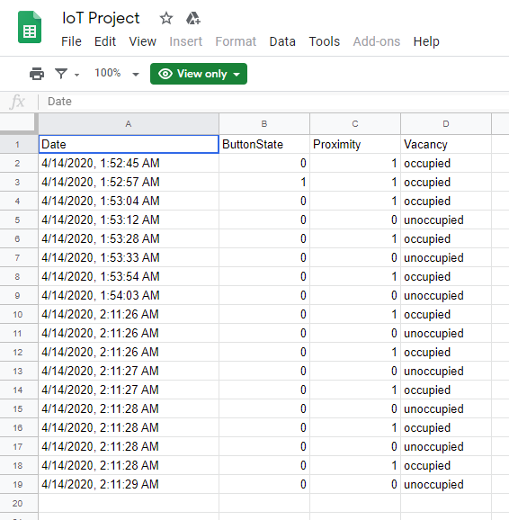
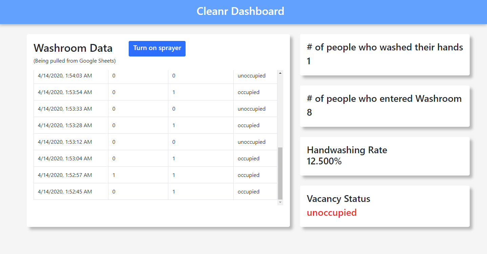
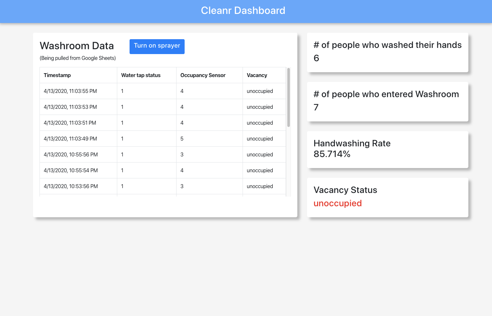

# Cleanr-4ID3-IoT-Project

## Summary
Personal hygiene is an important element of daily life and is of great importance in keeping our communities clean. This is especially true in pandemic breakouts like COVID-19. Handwashing, in particular, is an excellent way to maintain hygiene and prevent the spread of disease. Not all individuals wash their hands when using the washroom, however. Our project, Cleanr, will help evaluate how many people wash their hands after using the bathroom, without any invasive monitoring systems, such as cameras. When the person leaves the washroom, the sprayer automatically sprays an anti-bacterial spray to disinfect the area.

The system operates by using a button sensor integrated into a sink tap, and a proximity sensor within a bathroom stall. The Cleanr system will monitor when a user is in the bathroom stall, and whether or not the sink tap was used. By logging this data with timestamps, the data can be analyzed to see if users are washing their hands after utilizing the bathroom. This system only works with a single-person washroom.

</img>

## Bill of Materials
* Arduino MKR1000 (1)
* Proximity Sensor (1)
* Pushbutton (1)
* Airwick Freshmatic Sprayer (1)
* Raspberry Pi 4 (1)
* Male-to-Male Wires (10)
* Male-to-Female Wires (5)
* Bread Board (1)

## Tools
* Electrical tape
* AirWick disinfecting spray
* Multimeter for debugging

## Schematics

</img>
</img>

## Software Flows

### Flow 1: Create data analytics on the cloud web app when the person washes/stops washing their hands or enters/leaves the washroom
1. The two sensors are attached to the Arduino and the Arduino sends the data with MQTT to the hivemq broker.
    1. The pushbutton gets turned on (value = 1) when someone uses the water tap to wash their hands and turns off when the water tap is closed (value = 0) and the person is finished washing their hands. Whenever the value changes, data is sent.
    2. The proximity sensor reads a low number (value <= 480) when the person enters a stall and a high number (value >= 480) when the person leaves the stall. Whenever the value changes between low and high, data is sent.
2. The NodeJS server subscribes to messages that are being sent to the hivemq broker.
3. The NodeJS server then appends that data into the Google Spreadsheet.
4. The NodeJS server sends the data to the cloud web app using HTTP GET and the data analytics is displayed using an Angular frontend framework with Bootstrap UI Elements.

### Flow 2: The sprayer automatically sprays when a person leaves the washroom (whether they wash their hands or not)
1. The proximity sensor is attached to the Arduino and the Arduino sends the data to the hivemq broker with MQTT.
    1. The proximity sensor reads a low number (value <= 480) when the person enters a stall and a high number (value >= 480) when the person leaves the stall. Whenever the value becomes a high number, that means the person left, so data is sent.
2. The hivemq broker sends the data to the Raspberry Pi using MQTT and turns on the sprayer so that it sprays the antibacterial spray into the area.

### Flow 3: Wirelessly turning on the sprayer from the cloud web app
1. If a person clicks on the “Turn on sprayer” button on the cloud web app, that command data is sent back to the NodeJS server using HTTP GET.
2. The command data is then sent from the NodeJS server to the hivemq broker using MQTT sub/pub.
3. The hivemq broker then sends data to the Raspberry Pi using MQTT and that activates the sprayer so that it sprays the antibacterial spray into the area.

## Software and Apps Used
* Google Sheets
* Arduino MQTT Library Used (for the Arduino MKR1000 to broadcast messages via MQTT): https://github.com/arduino-libraries/ArduinoMqttClient
* Eclipse Paho MQTT C Client Library Used (for the Raspberry Pi 4 to receive incoming messages via MQTT): https://github.com/eclipse/paho.mqtt.c
* HiveMQ Broker: broker.hivemq.com
* Angular Framework (Web App’s Front End): https://angular.io/
* Bootstrap (Web App’s UI Elements): https://getbootstrap.com/ 
* NodeJS Server: https://nodejs.org/en/
* Web App: https://timetowashyourhands.web.app/

## Algorithm
</img>

## Videos and Images

### Arduino MKR1000 Hardware Setup
</img>

### Raspberry Pi 4 and Sprayer Setup
</img>

### Google Sheets
</img>

### Data Analytics on Cloud Web App
</img>

</img>
