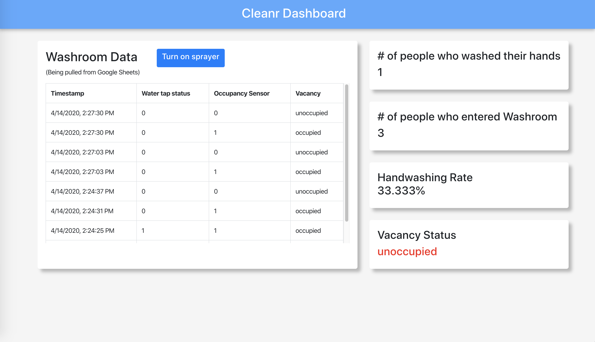

# Cleanr-4ID3-IoT-Project

## Summary
Personal hygiene is an important element of daily life and is of great importance in keeping our communities clean. This is especially true in pandemic breakouts like COVID-19. Handwashing, in particular, is an excellent way to maintain hygiene and prevent the spread of disease. Not all individuals wash their hands when using the washroom, however. Our project, Cleanr, will help evaluate how many people wash their hands after using the bathroom, without any invasive monitoring systems, such as cameras. When the person leaves the washroom, the sprayer automatically sprays an anti-bacterial spray to disinfect the area.

The system operates by using a button sensor integrated into a sink tap, and a proximity sensor within a bathroom stall. The Cleanr system will monitor when a user is in the bathroom stall, and whether or not the sink tap was used. By logging this data with timestamps, the data can be analyzed to see if users are washing their hands after utilizing the bathroom. This system only works with a single-person washroom.

</img>
</img>

## Bill of Materials
* Arduino MKR1000 (1)
* Proximity Sensor (1)
* Pushbutton (1)
* Airwick Freshmatic Sprayer (1)
* Raspberry Pi 4 (1)
* Male-to-Male Wires (10)
* Male-to-Female Wires (5)
* Bread Board (1)

## Tools
* Electrical tape
* AirWick disinfecting spray
* Multimeter for debugging
